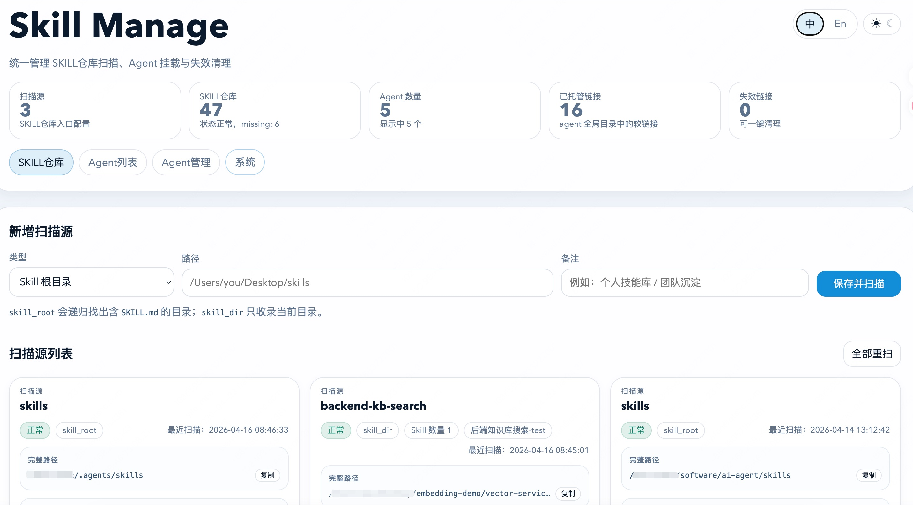

# 🗃️ Skill Manager

[English](./README.md) | 中文



**面向 Codex、ClaudeCode、Hermes、OpenClaw 的开源、本地优先 Agent Skill 管理工具。**

Agent Skill Manager 是一个本地 Web 控制台，用来统一整理多个 AI Agent 之间共享的 Skill 目录。它只聚焦一件事：把 SKILL仓库、Agent 挂载链接、失效目录和本地 Skill 库集中到一个地方管理清楚。

如果你在搜索开源的 Agent Skill 管理工具、SKILL仓库管理工具、多 Agent Skill 库管理界面，或者希望找到一个能处理软链接挂载、失效链接清理、`SKILL.md` 目录扫描的本地工具，这个项目就是为这类场景设计的。

项目依然刻意保持轻量，但已经采用工程化目录：Python 后端位于 `src/skill_manage/`，前端页面位于 `web/`，启动辅助脚本位于 `scripts/`，运行时产物写入 `data/` 和 `logs/`。

默认部署模型是仅本机使用：内置服务只面向 `127.0.0.1`、`localhost`、`::1` 这类回环地址。

## 搜索关键词

- `Agent Skill 管理`
- `开源 本地优先 Skill 管理工具`
- `SKILL仓库 管理`
- `多 Agent Skill 库`
- `Codex skills 管理`
- `ClaudeCode skills 管理`
- `Hermes skills 管理`
- `OpenClaw skills 管理`
- `软链接 Skill 挂载`
- `失效链接 清理`
- `本地 Skill 仓库 清理`
- `SKILL.md 目录扫描`

## 应用当前能做什么

- 以两种模式扫描本地 Skill 来源：
  - `skill_root`：递归收录所有包含 `SKILL.md` 的目录
  - `skill_dir`：直接登记一个独立 Skill 目录
- 维护本地 SKILL仓库，并持久化 Skill 元数据、健康状态和搜索信息。
- 在一个界面里管理 Agent 目录，包括当前目录、默认目录、挂载软链接、真实目录和失效条目。
- 把 Agent 中的真实 Skill 目录迁入共享仓库，并通过托管软链接继续挂载。
- 重扫扫描源和 Agent 目录、清理失效链接，并基于内容比较相似 Skill。
- 将扫描源、本地 Skill、Agent 配置、托管链接和操作日志持久化到 SQLite。

## 当前界面页签

### SKILL仓库

- 新增扫描源，并支持原地重扫。
- 从卡片弹窗编辑已有扫描源，保存后立即重新扫描。
- 以卡片形式浏览仓库条目，并在需要时删除记录。
- 对状态正常的仓库 Skill 执行相似度扫描。

### Agent 列表

- 一次聚焦一个当前 Agent，并通过内联选择器切换 Agent。
- 查看当前配置目录、默认目录、已挂载 Skill、真实 Skill 目录和失效链接。
- 从共享仓库检索可添加的 Skill，并挂载到当前 Agent。
- 将真实目录导入共享仓库、移动到其他仓库根目录，或按需删除。
- 在当前 Agent 上下文内执行相似度扫描。

### Agent 管理

- 手动创建自定义 Agent 记录。
- 自动检索 `Codex`、`ClaudeCode`、`OpenClaw`、`Hermes` 的内置默认目录。
- 列表中只保留当前配置目录和默认目录两类配置。
- 支持编辑 Agent、设为当前、切换显示/隐藏状态，并从注册表删除。

### 系统

- 展示服务状态、服务地址、SQLite 路径和 Python 版本等系统状态卡片。
- 展示最近操作日志，聚焦写入/更新类操作，不记录启动初始化噪音。

## 语言切换

- 页面右上角提供 `中 / En` 切换控件，用于在中文和英文之间切换固定界面文案。
- 默认语言为中文。
- 选中的语言会写入浏览器 `localStorage`，键名为 `skill-manage-language`。

## 已支持的 Agent

当前实现内置支持以下目标：

| Agent | 默认路径 |
| --- | --- |
| Codex | `~/.codex/skills` |
| ClaudeCode | `~/.claude/skills` |
| Hermes | `~/.hermes/skills` |
| OpenClaw | `~/.openclaw/skills` |

自动检索对每个 Agent 只扫描一条内置默认路径。完成登记后，界面会同时保留每个 Agent 的当前配置目录和默认目录。

## 项目目录结构

| 路径 | 作用 |
| --- | --- |
| `src/skill-manage-server.py` | 兼容入口，用来启动 package 化后的后端 |
| `src/skill_manage/` | Python 后端 package，包含启动、HTTP 处理、services、repositories、数据库和工具模块 |
| `web/skill-manage.html` | 完整本地管理控制台的单文件前端 |
| `scripts/start.sh` | 启动辅助脚本，负责检查 Python、安装依赖、释放目标端口并拉起服务 |
| `data/skill-manage.sqlite3` | 运行时 SQLite 数据库 |
| `logs/skill-manage.log` | 运行日志文件 |
| `requirements.txt` | 启动脚本使用的 Python 依赖清单 |
| `docs/dependencies.md` | 依赖清单和运行说明 |

## 快速开始

### 环境要求

- Python 3.10+
- 推荐使用类 Unix 环境
- 文件系统支持软链接

说明：

- 启动前会先检查 Python 环境是否正常。
- 如果 Python 不可用或环境损坏，启动会直接失败，并提示检查 Python 环境。
- 如果 Python 正常，`./scripts/start.sh` 会先读取 `requirements.txt` 自动安装依赖，再启动服务。
- 后端尽量只使用标准库，但项目仍保留 `requirements.txt` 作为自动安装入口。
- 默认 host 为 `127.0.0.1`。

### 启动服务

运行兼容入口：

```bash
python3 src/skill-manage-server.py --open
```

运行 package 模块：

```bash
PYTHONPATH=src python3 -m skill_manage --open
```

运行辅助脚本：

```bash
./scripts/start.sh
```

默认访问地址：

```text
http://127.0.0.1:8765/
```

服务启动成功后，Python 服务会记录启动成功日志以及绑定端口信息。

## 典型使用流程

1. 先在 `SKILL仓库` 页签中添加一个或多个扫描源。
2. 让扫描器收录所有包含 `SKILL.md` 的目录。
3. 打开 `Agent 管理`，自动检索或手动登记你实际使用的 Agent 目录。
4. 切换到 `Agent 列表`，选择当前 Agent，并从共享仓库挂载可复用 Skill。
5. 将 Agent 中的真实目录导入共享仓库，或者在不同仓库根目录之间移动它们。
6. 使用相似度扫描，提前发现重复或高度重叠的 Skill，避免仓库再次失控。

## 典型适用场景

- 为多个 AI 编码 Agent 建一个共享的本地 SKILL仓库。
- 清理历史遗留的软链接、失效挂载和重复 Skill 目录。
- 把 Agent 目录中的真实 Skill 文件夹迁移到统一托管仓库。
- 快速查看当前 Agent 已挂载哪些 Skill，并重新扫描最新状态。
- 维持本地优先工作流，而不是依赖远程同步服务或在线市场。

## HTTP API

前端通过一个本地 JSON API 与后端交互。当前接口包括：

| 方法 | 接口 | 作用 |
| --- | --- | --- |
| `GET` | `/api/state` | 获取完整页面状态 |
| `GET` | `/api/agents` | 获取已登记 Agent |
| `GET` | `/api/operation-logs` | 获取分页操作日志 |
| `POST` | `/api/scan-roots` | 保存并扫描一个扫描源 |
| `POST` | `/api/scan-roots/update` | 更新一个扫描源并立即重扫 |
| `POST` | `/api/scan-roots/rescan` | 重扫全部扫描源 |
| `POST` | `/api/scan-roots/item/rescan` | 重扫单个已保存扫描源 |
| `POST` | `/api/local-skills` | 手动添加一个本地 Skill |
| `POST` | `/api/local-skills/find-similar` | 在仓库中查找相似 Skill |
| `POST` | `/api/local-skills/move` | 把本地 Skill 移动到另一个仓库根目录 |
| `POST` | `/api/agents` | 创建一个 Agent |
| `POST` | `/api/agents/update` | 更新一个 Agent |
| `POST` | `/api/agents/auto-discover` | 自动检索内置 Agent 目录 |
| `POST` | `/api/agents/visibility` | 切换 Agent 显示/隐藏状态 |
| `POST` | `/api/agents/{agent}/path` | 保存单个 Agent 的当前配置目录 |
| `POST` | `/api/agents/{agent}/scan` | 重扫单个 Agent 目录 |
| `POST` | `/api/agents/{agent}/scan-default-to-local` | 将当前配置目录扫描进仓库 |
| `POST` | `/api/agents/{agent}/link` | 把一个仓库 Skill 挂载到 Agent 目录 |
| `POST` | `/api/agents/{agent}/move-direct-to-local` | 把一个 Agent 真实 Skill 迁入仓库 |
| `POST` | `/api/agents/{agent}/delete-direct-skill` | 删除 Agent 目录中的真实 Skill 文件夹 |
| `POST` | `/api/agents/{agent}/cleanup-invalid` | 清理 Agent 目录中的失效软链接 |
| `POST` | `/api/agents/{agent}/find-similar` | 在单个 Agent 上下文中查找相似 Skill |
| `DELETE` | `/api/scan-roots?path=...` | 删除一个已保存扫描源 |
| `DELETE` | `/api/links?path=...` | 删除一个挂载软链接 |
| `DELETE` | `/api/local-skills?path=...` | 删除一个本地 Skill 记录 |
| `DELETE` | `/api/agents?agent_code=...` | 删除一个已登记 Agent |

## 运行时与安全说明

- 状态数据保存在 `data/skill-manage.sqlite3`。
- 运行日志写入 `logs/skill-manage.log`。
- 应用使用 SQLite `DELETE` journal mode，因此正常运行时不应持续保留 `sqlite3-wal` 和 `sqlite3-shm` 文件。
- 操作日志只关注有意义的写入/更新行为，不记录初始化完成之类的噪音。
- 清理失效链接只会删除软链接条目，不会删除真实 Skill 目录。
- 删除 Agent 目录中的真实 Skill 文件夹属于破坏性操作，需要谨慎使用。
- 内置服务默认仅本机可用；如果不是回环地址，将拒绝启动。只有显式设置 `SKILL_MANAGE_ALLOW_REMOTE=1` 才允许远程绑定。
- CORS 仅允许来自回环地址的本地 Web 来源，不再使用通配符放开。

## 开源许可

本项目采用 MIT License，详见 [LICENSE](./LICENSE)。

## 当前范围

这个项目只聚焦本地 Skill 管理，不打算做远程同步服务，也不是 Skill 市场。

它适合以下场景：

- 个人多 Agent 本地环境
- 共享本地 Skill 仓库
- 长期积累后的 Skill 目录清理与规范化
- 希望用一个轻量本地控制台替代多个零散目录的团队场景

## Star History

[](https://www.star-history.com/?repos=im-fan%2Fskill-manage&type=date&legend=top-left)
